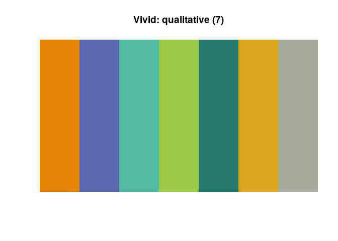
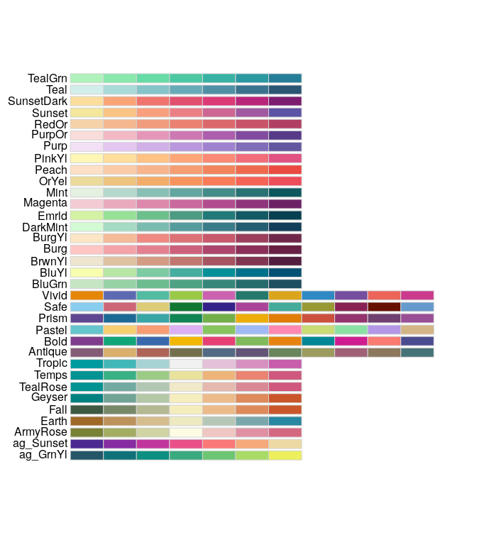

<!-- README.md is generated from README.Rmd. Please edit that file -->
rcartocolor
===========

[](https://travis-ci.org/Nowosad/rcartocolor) [](https://codecov.io/github/Nowosad/rcartocolor.png?branch=master)

The goal of `rcartocolor` is to provide color schemes for maps and other graphics designed by [CARTO](https://carto.com/) as described at <https://carto.com/carto-colors/>.

Installation
------------

You can install `rcartocolor` from github with:

``` r
# install.packages("devtools")
devtools::install_github("Nowosad/rcartocolor")
```

Example
-------

Display a CARTOcolor palette:

``` r
library(rcartocolor)
display_carto_pal(7, "Vivid")
```



Create a CARTOcolor palette:

``` r
my_colors = carto_pal(7, "Burg")
my_colors
#> [1] "#ffc6c4" "#f4a3a8" "#e38191" "#cc607d" "#ad466c" "#8b3058" "#672044"
```

All of the CARTOcolor palettes:

``` r
display_carto_all()
```


