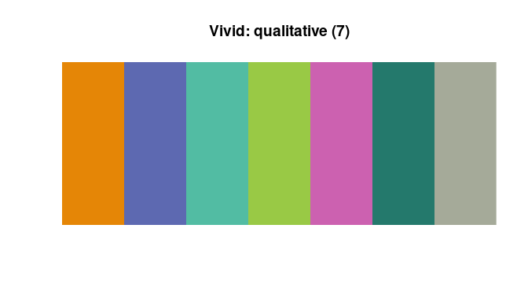
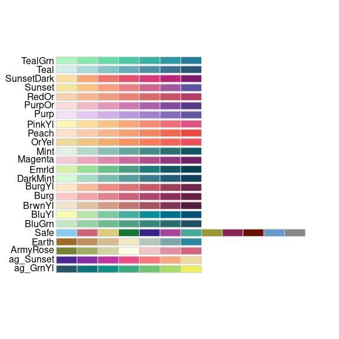
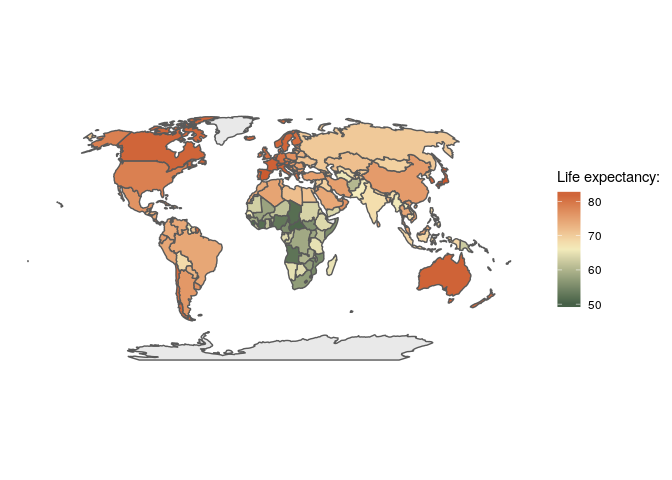
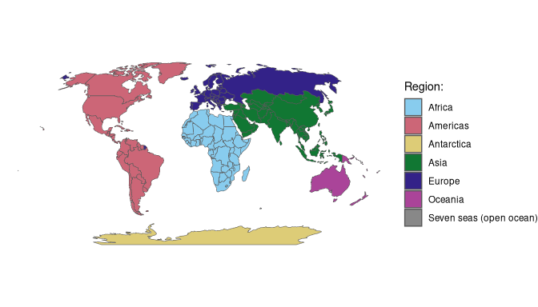

<!-- README.md is generated from README.Rmd. Please edit that file -->

# rcartocolor

<!-- badges: start -->

[](https://github.com/Nowosad/rcartocolor/actions/workflows/R-CMD-check.yaml)
[](https://codecov.io/gh/Nowosad/rcartocolor)
[](https://cran.r-project.org/package=rcartocolor)
[](https://cran.r-project.org/package=rcartocolor)
<!-- badges: end -->

The goal of `rcartocolor` is to provide color schemes for maps and other
graphics designed by [CARTO](https://carto.com/) as described at
<https://carto.com/carto-colors/>.

## Installation

Get the released version from CRAN:

``` r
install.packages("rcartocolor")
```

Get the development version from github:

``` r
# install.packages("remotes")
remotes::install_github("Nowosad/rcartocolor")
```

## Examples

Display a CARTOcolor palette:

``` r
library(rcartocolor)
display_carto_pal(7, "Vivid")
```

<!-- -->

Create a CARTOcolor palette:

``` r
my_colors = carto_pal(7, "Burg")
my_colors
#> [1] "#FFC6C4" "#F4A3A8" "#E38191" "#CC607D" "#AD466C" "#8B3058" "#672044"
```

Display all of the CARTOcolor palettes:

``` r
display_carto_all()
```

<!-- -->

[Only display colorblind friendly
palettes](https://nowosad.github.io/colorblindcheck/articles/articles/check_rcartocolor.html):

``` r
display_carto_all(colorblind_friendly = TRUE)
```

<!-- -->

### **ggplot2**

The **rcartocolor** package contains four **ggplot2** color scales: two
for continuous data - `scale_fill_carto_c`, `scale_color_carto_c` and
two for discrete data - `scale_fill_carto_d`, `scale_color_carto_d`:

``` r
# devtools::install_github("tidyverse/ggplot2")
library(sf)
#> Linking to GEOS 3.11.1, GDAL 3.6.4, PROJ 9.1.1; sf_use_s2() is TRUE
library(spData)
#> To access larger datasets in this package, install the spDataLarge
#> package with: `install.packages('spDataLarge',
#> repos='https://nowosad.github.io/drat/', type='source')`
library(ggplot2)
ggplot(world, aes(fill = lifeExp)) +
        geom_sf(data = world) +
        coord_sf(crs = "+proj=robin") +
        scale_fill_carto_c(name = "Life expectancy: ",
                           type = "diverging", palette = "Earth", direction = -1) +
        theme_void()
```

<!-- -->

``` r
ggplot(world, aes(fill = region_un)) +
        geom_sf(data = world) +
        coord_sf(crs = "+proj=robin")  +
        scale_fill_carto_d(name = "Region: ", palette = "Safe") +
        theme_void()
```

<!-- -->

## Contributions

[Feel free to submit issues and enhancement
requests.](https://github.com/Nowosad/rcartocolor/issues)
